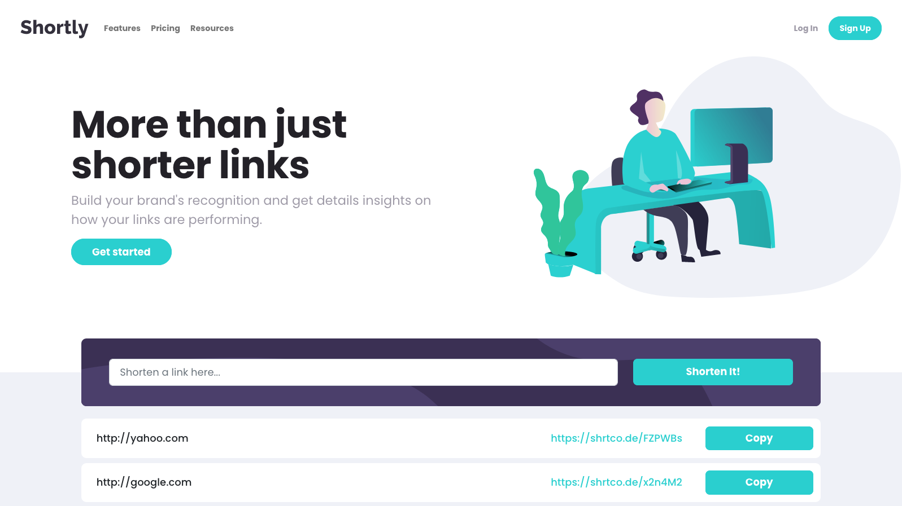
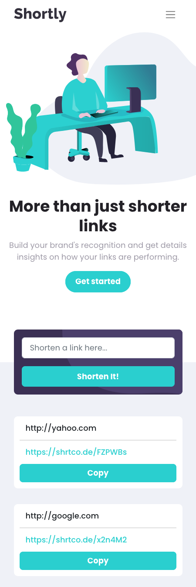

# Frontend Mentor - Shortly URL shortening API Challenge solution

This is a solution to the [Shortly URL shortening API Challenge challenge on Frontend Mentor](https://www.frontendmentor.io/challenges/url-shortening-api-landing-page-2ce3ob-G). Frontend Mentor challenges help you improve your coding skills by building realistic projects.

## Table of contents

- [Overview](#overview)
  - [The challenge](#the-challenge)
  - [Screenshot](#screenshot)
  - [Links](#links)
- [My process](#my-process)
  - [Built with](#built-with)
  - [What I learned](#what-i-learned)
- [Author](#author)

## Overview

### The challenge

Users should be able to:

- View the optimal layout for the site depending on their device's screen size
- Shorten any valid URL
- See a list of their shortened links, even after refreshing the browser
- Copy the shortened link to their clipboard in a single click
- Receive an error message when the `form` is submitted if:
  - The `input` field is empty

### Screenshot

**Desktop:**



**Mobile:**

<p style="text-align: center"></p>

### Links

- Solution URL: [GitHub](https://github.com/kkatlopez/frontend-mentor-shorten-url-api-landing)
- Live Site URL: [Vercel](https://your-live-site-url.com)

## My process

### Built with

- CSS custom properties
- Flexbox
- Mobile-first workflow
- [React](https://reactjs.org/) - JS library
- [React Bootstrap](https://react-bootstrap.github.io/)
- [Sass](https://sass-lang.com/)

### What I learned

Great practice for functional React and using multiple components. Also sharpened my Sass skills.

Worked with `localStorage` to save the user's links:

```JSX
useEffect(() => {
    localStorage.setItem("links", JSON.stringify(urlList));
}, [urlList])
```

where `urlList` is the list of saved from storage.

---

Using the `urlList`, the logic also checks if the original URL has already been shortened by indexing through the list. This happens after the API has been called.

```JSX
var index = urlList.findIndex((item => item[0] === shortLink));
    // If URL hasn't been found, set the list
    if (index === -1) {
        var links = [shortLink, originalLink];
        setUrlList([...urlList, links])
        setError("");
        setErrorClass("");
        // Clear input after URL is shortened
        textInput.current.value = "";
    }
}
```

---

Used `navigator.clipboard.writeText()` to copy the short code to the user's clipboard.

```JSX
function copyToClipboard(url) {
    navigator.clipboard.writeText(url);
    setClickedClass("clicked");
    setButtonText("Copied!");
}
```

## Author

- Website - [Kat Lopez](https://linkedin.com/in/kkatlopez)
- Frontend Mentor - [@kkatlopez](https://www.frontendmentor.io/profile/kkatlopez)
